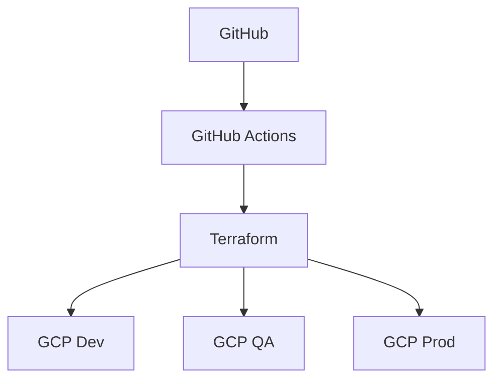

# Terraform GCP multiambiente (GIM)

Base Terraform para GitHub + GCP con mapeo por ramas:

- develop -> Dev
- qa -> QA
- prod -> Produccion

## Estructura

- environments/dev, environments/qa, environments/prod
- modules/naming, iam, storage, bigquery, secret_manager
- modules/composer, dataproc, dataplex, vpn, pubsub, cloud_run
- .github/workflows

## Instalacion para simular local

1. Instalar Git.
2. Instalar Terraform >= 1.7.
3. Instalar Google Cloud SDK (gcloud + gsutil).
4. (Opcional) Instalar tflint y tfsec para controles extra.

Verificacion rapida de herramientas:

```powershell
git --version
terraform version
gcloud version
gsutil version -l
```

## Simulacion local sin desplegar recursos

Desde cada ambiente:

```powershell
cd terraform-gcp/environments/dev
terraform init -backend=false
terraform fmt -check -recursive
terraform validate
```

Esto valida sintaxis, dependencias de modulos y estructura.

> Nota: los módulos `composer`, `dataproc`, `dataplex`, `pubsub`, `cloud_run` y `vpn` están como placeholders y actualmente no crean recursos GCP reales.

## Ejecucion real (con backend GCS)

1. Crear bucket de state (ver scripts/bootstrap.ps1).
2. Configurar autenticacion (ADC local o WIF en GitHub Actions).
3. Inicializar backend remoto:

```powershell
cd terraform-gcp/environments/dev
terraform init -backend-config="bucket=TU_BUCKET_STATE" -backend-config="prefix=environments/dev"
```

4. Ejecutar plan:

```powershell
terraform plan -var-file=terraform.tfvars -input=false
```

## Workflows GitHub

- terraform-validate.yml: fmt, init, validate, plan en develop/qa/prod.
- terraform-apply.yml: apply solo en develop/qa/prod.

## Bootstrap inicial

Ejemplo:

```powershell
cd terraform-gcp/scripts
./bootstrap.ps1 -ProjectId gim-data-dev -Region us-central1 -StateBucket gim-tfstate-dev
```

> Importante: `secret_value` en los archivos `terraform.tfvars` es un valor de ejemplo y debe reemplazarse por un secreto real o gestionarse mediante otro mecanismo seguro.

## Mermaid



## Nota importante

El proyecto queda listo para simulacion local completa con validate. Para plan/apply real necesitas:

- Proyecto GCP existente
- APIs habilitadas
- Permisos IAM
- Backend GCS
- Autenticacion (ADC local o WIF en CI)
